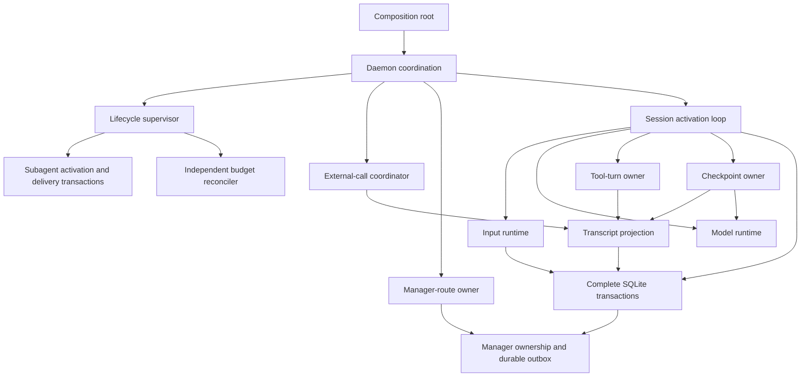

# Core refactoring completion audit

Scope: [the core goal](refactoring-goal.md), from baseline `7678d2c` through
the current worktree on `refactor/runtime-ownership`. This is evidence for
completion, not a replacement architecture document.

**Status: complete.** Source ownership, focused scenarios, documentation and
independent reviews are complete. Full local tests, canonical CI and final
`make all` pass in an unrestricted environment.
The presence of a component or a passing narrow test does not close a row below.

## Requirement audit

| Goal requirement | Evidence required | Current conclusion |
| --- | --- | --- |
| No unresolved concentration of unrelated mutable core state | Inspect daemon/session/lifecycle/persistence owners and their consumers; justify retained coordination | Source audit and two independent code reviews found cohesive owners and no unresolved unrelated mutable concentration; retained coordination is justified below |
| Named owners and explicit ordering for representative flows | Trace production entry, state transition, durable boundary and recovery for every flow below | Source paths, focused durable/temporal scenarios and full local/CI suites support every flow below |
| Every extraction removes obligations from its former owner | Source search for removed state/mutation paths; compare complete operations before/after | Lifecycle/external-call/route/model/tool/checkpoint state moved with operations; three obsolete persistence algorithms and their executable tests were migrated |
| Behavioral checks, architecture sync and independent code review | Exact final commands/results plus clean specification and code reviews | Cold specification and code reviews are clean after one P1 fix; focused scenarios, full local tests, canonical CI and final `make all` pass |
| Remaining debt has explicit reasons | Distinguish necessary coordination, optional organization and unresolved defects | Retained core coordination and deferred organization are justified below; no unresolved core defect was found |

## Integrated flow evidence

| Flow | Authority and ordering to verify | Existing evidence anchors |
| --- | --- | --- |
| Accepted input to response | Daemon admission routes durable input; inputruntime promotes it; session decides an accepted-response disposition; sessionstore atomically records message/accounting/budget/candidate/output | Durable loop/input-order tests; response-disposition tests; input-recovery and response-integrity scenarios |
| Child completion to parent | Lifecycle derives the canonical recovered outcome; subagent transactions arbitrate activation and delivery; parent reload follows a winning transcript/link commit; typed routing keeps blocking results distinct from background inbox facts | Completion/rearm/restart protocol models; candidate-result and duplicate-delivery scenarios |
| Stop and interrupted-stop recovery | Tree fence and durable stopping intent precede producer cancellation; signal all runners before joins; cancellation Done precedes fence-dependent child finalization; coordinator settles calls before terminal stop output | Supervisor protocol tests; cancellation/fence regression; interrupted-stop and orphan-settlement scenarios |
| Budget crossing | Response accounting and cost crossing stay one transaction; independent lifecycle timer observes duration; generation-fenced park joins work and uses the same tree-stop operation | Budget transaction tests; independent deadline/restart/shutdown tests; park race and budget scenarios |
| Context checkpoint | Safe point follows completed tool batches; checkpoint owner preserves candidate/nudge and row identities; atomic replacement precedes baseline invalidation and outcomes; publication failure cannot undo a committed result | Compaction protocol model; pin, native-prefix, ordering and command scenarios; new post-commit progress-failure regressions |
| Model lifetime | Owner leases the current client through Chat; switch replaces identity and measurement generation together; terminal close rejects and releases a late replacement | In-flight switch/close tests; constructor-barrier regression; same-model baseline restore and reset/compaction invalidation |
| Resource shutdown | Daemon closes admission and cancels recovery; joins runners/processes/reconcilers/park workers; session closes model before stack; shared tool-resource lifetime closes last | Daemon shutdown/recovery tests; composition-root lifecycle tests; factory-wrapper resource/process regression |
| Manager ownership and delivery | Route owner serializes claims and replacement; stale route reads yield to committed claims; replacement retains its ownership fence through old-root retirement; durable outbox remains delivery authority | Publication ownership model; concurrent-claim and late-claim tests; replacement routing and real Telegram delivery scenarios |

## Responsibility changes

| Boundary | Former distributed responsibility | Inspected result |
| --- | --- | --- |
| Lifecycle supervisor | Daemon mutated registry, admission counters, queues and tree locks separately | Those containers exist only under supervisor; daemon invokes complete operations |
| Accepted response and recovered outcome | Optional dependencies selected a legacy response algorithm; lifecycle reinterpreted transcript meaning | One executable disposition path; one store projection for recovered outcome |
| Budget reconciliation | Progress capture also enforced deadlines and triggered park | Progress has no budget-control dependency; independent worker is cancellable and joined |
| Model runtime | Session held client/configuration/mutex/epoch/baseline | Model owner contains all state and mutations; consumers use leased operations and snapshots |
| External-call coordinator | Daemon staged calls, claimed/applied config and settled grants/transcripts across unrelated runner methods | Daemon owns no staged/applier/activation-store fields; exact-result and failure cleanup transitions are complete owner operations |
| Tool-turn owner | Tool pipeline accepted the complete mutable session and updated detector/grant/suspension/progress directly | Pipeline accepts direct capabilities and operation inputs; typed outcomes carry committed effects even on later errors |
| Checkpoint owner | Session and loop shared command/focus/defer/attempt/summary state and checkpoint transactions | One owner performs complete attempt/command lifecycle; loop only selects safe point and adopts outcome |
| Manager-route owner | Daemon held publication caches and claim/replacement serialization | Route state and mutations reside together; replacement has one complete ownership-fenced operation |

## Integrated ownership map

Arrows indicate coordination or a direct capability dependency, not package
imports. Private owners remain inside their existing packages.

Source anchors for the map and ordering:

- [Supervisor](../internal/sessionlifecycle/supervisor.go) pairs admission and
  registry lifetime; [tree stop](../internal/sessionlifecycle/tree_stop.go)
  owns signal-all, join, resource retirement and settlement ordering.
- [Child completion](../internal/sessionlifecycle/completions.go) terminalizes
  through the subagent transaction, reloads a parent only after winning
  delivery, then attempts rearm. Callbacks route effects across owners.
- [External-call settlement](../internal/daemon/external_call_settlement.go)
  adopts orphan identity before opening a transcript and releases temporary
  adoption even on failure. Ordinary result ownership retires after acceptance
  in [Resolve](../internal/daemon/external_calls.go).
- [Manager routes](../internal/daemon/manager_routes.go) retain ownership
  serialization through replacement and retirement; publication uses only the
  independent cache lock, so retirement can publish within the fence.
- [Model runtime](../internal/session/model.go) leases the client through I/O
  and makes close terminal. [Tool turns](../internal/session/toolexec.go)
  consume explicit grants and return committed effects; they receive no
  session container. [Checkpoints](../internal/session/context_runtime.go)
  own command/defer/attempt state; the loop chooses the safe point.
- [Accepted-response persistence](../internal/sessionstore/completion_check_store.go)
  commits paid message, common budget observation, disposition and output in
  one transaction. [Tool-result persistence](../internal/sessionstore/direct_output_store.go)
  owns call identity, completion invalidation and optional direct output.

The remaining session transcript lock intentionally protects one projection and
its row-ID sidecar. Checkpoint operations use that same projection; model
operations never acquire its lock. A second transcript container would make
ordering and replacement harder to prove.

## Retained coordination and deferred work

- **Daemon startup/shutdown and producer routing:** the application must order
  stop recovery, process interruption, call settlement and ordinary resume. It
  also selects delivery variants across genuine owners. Retain this coordination
  only where it consumes complete domain operations rather than mutating their
  private state; independent review confirmed that condition.
- **Session loop and activation protocol:** input acquisition, safe operation
  points, terminal grant resolution and budget-driven exit belong to the one
  activation. Tool turns consume an activation but do not own every transition
  that can occur without a tool call.
- **Shared SQL receiver:** it owns only a database handle. Consumers already
  receive narrow capabilities; response, input, output and child-delivery
  invariants require cross-table transactions. Splitting by table would not
  reduce an established state owner and is deferred absent a concrete problem.
- **Project-store location, method/file counts and query organization:** useful
  only when tied to an independently changing responsibility or demonstrated
  performance problem. They are not size quotas for this effort.
- **Telegram manager decomposition:** outside the core goal. Manager ownership
  and durable delivery behavior remain covered by integration evidence.
- **Budget gate scheduling callback:** `sessionBudgetGate` still references the
  daemon for its park effect. It holds no competing mutable budget state; the
  budget transaction owns firing and the daemon owns tree parking. A narrower
  callback would reduce a dependency edge but would not remove another owner.
- **Compaction deferral announcement:** this small cache spans reconstructed
  session objects and belongs to daemon identity coordination. Moving it into
  one session object would lose its lifetime guarantee.

## Audit findings and closure evidence

- The old InsertBudgetedResponse algorithm had no production callers, but its
  tests hid missing budget observation/non-execution in canonical dispositions.
  It was removed and the canonical transaction corrected. The migrated store
  scenarios failed before correction, then passed with independent cost-model,
  disposition-matrix and rollback assertions (10.207s). A daemon scenario
  reproduced two tool executions after crossing, then passed with zero crossing
  executions and correct park/resume behavior (0.786s); the same real daemon
  scenario passed again after the post-commit adoption fix (1.196s).
- Two more test-only alternate transactions, InsertAssistantMessageWithOutput
  and InsertToolResultWithDirectOutput, were removed. Their atomic output,
  generation, stop and replay tests now use canonical operations and passed
  focused acceptance; ordinary generation seed corpus passed too. Host final
  promotion, commands and lifecycle output remain distinct legitimate operations.
- Final ownership inspection found two residual contract gaps: nil-output
  recovery selected raw result insertion without canonical replay/invalidation,
  and heartbeat cancellation did not join its worker. The validated
  [correction plan](../plan-2026-09-28-settlement-and-worker-lifetime.md) also
  preserves attachments omitted by the canonical insert. Both corrections and
  their real-SQLite/deterministic lifetime regressions passed focused acceptance.
- Independent code review found one consequential budget handoff bug after the
  canonical transaction: a failed transcript reload hid its already-committed
  fired verdict. The new real-SQLite test failed before the fix and passed after
  it; the session now schedules the park before reading history and leaves the
  committed response suspended on a read failure. Both code and specification
  re-reviews found the correction sound.
- A focused full-CI failure in `TestHeaderCheckCountsTheSystemPrompt` was a
  fixture wiring error: the test replaced the session prompt pointer after the
  checkpoint owner had captured the earlier pointer. It now reconstructs the
  owner with the new prompt; the exact header checks passed.
- The unrestricted CI run exposed the same fixture-wiring error in
  `TestShouldCompact/at_cutoff_exactly_is_not_over`. Reconstructing its
  checkpoint owner with the replacement prompt restored the exact-cutoff
  scenario. The focused test and complete CI rerun passed.
- Semgrep's old `runner.go`-only call-settlement exception was updated for the
  three exact external-call owner files. Independent review confirmed their
  queued-result, fenced-abandonment and startup-orphan paths and found no
  bypass; the full Semgrep scan passed afterward.

## Final verification record

- Cold specification review of the integrated five plans: clean, with no
  concrete implementation-to-plan mismatch. All committed session test and
  literal subtest names remain after fixture recovery; exact unsaved local
  assertions cannot be independently compared.
- Independent code review of the complete refactor: one P1 committed-budget
  adoption finding corrected and re-reviewed clean; the complementary daemon,
  lifecycle and routing review was clean.
- Full local `make test`: exit 0 in the unrestricted environment. All fast
  packages passed, including the listener-dependent packages previously blocked
  by the managed sandbox. The delegated full `make lint` also passed with zero
  issues after the final fixture correction.
- Canonical `CI=true make ci`: the first unrestricted run passed format, build,
  lint, architecture, Semgrep and both gitleaks scans, then found the exact
  compaction-cutoff fixture failure above. The focused correction passed, and
  the complete rerun exited 0 with every tagged integration package passing,
  including daemon, session, sessionstore, Telegram and migrations. Fixture Git
  configuration was isolated from the invoking user's credentials.
- Final `make all`: exit 0 after the documentation update; formatting, build,
  lint, architecture and bounded local tests passed.
- Final source/flow audit and architecture reconciliation: complete; the
  source anchors above match the synced ARCHITECTURE.md, glossary and ADRs.

The lost pre-cleanup local test assertions cannot be compared byte-for-byte
without a snapshot. Every committed test and literal subtest name was restored;
the selected recovery scenarios and complete local/CI suites passed. This is a
coverage provenance limit, not a failing gate.
